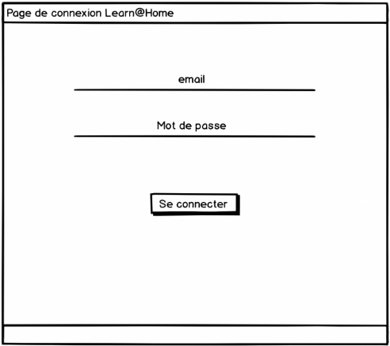

## **Contexte général du projet**

**Client** : Learn\@Home
**Type d’organisation** : Association
**Mission** : Mettre en relation des enfants en difficulté scolaire avec des bénévoles pour du soutien scolaire en ligne.
**Objectif principal** : Offrir un site web complet pour faciliter les échanges et l'organisation des rendez-vous entre élèves et tuteurs.

Chaque élève est assigné à un tuteur bénévole, qui l’aide chaque semaine à faire ses devoirs et à s’organiser. Le soutien se fait à distance, via le site web.

---

## **Pages attendues dans le site**

### 1. Page de connexion

* Accès restreint : toutes les autres pages nécessitent d’être connecté.
* Fonctionnalités :

  * Formulaire de connexion
  * Lien de création de compte
  * Fonction « mot de passe oublié »
* Visuel :
  

---

### 2. Tableau de bord (page principale)

* Centralise les informations clés depuis les autres pages :

  *  Liste des tâches (to-do list) issues de la page de gestion des tâches
  *  Prochains événements issus du calendrier
  *  Compteur de messages non lus
* Rôle : point d’entrée après connexion, vue synthétique

---

### 3. Interface de chat

* Système de messagerie instantanée entre élèves et tuteurs
* Fonctionnalités attendues :

  * Historique des conversations
  * Ajout / suppression de contact
  * Photo de profil à côté de chaque message
  * Indicateur de lecture des messages (lu / non lu)
  * Horodatage de chaque message

* Visuel :
  
  

---

### 4. Calendrier

* Affiche les événements et rendez-vous planifiés de l’utilisateur (élève ou tuteur)
* Permet :

  * L’ajout et la suppression d’événements
  * Une vision claire des créneaux à venir
* Le tuteur comme l’élève peuvent ajouter des événements à leur propre calendrier

---

### 5. Gestion des tâches

* Permet la gestion de tâches personnelles ou assignées :

  * L’élève peut créer des tâches **pour lui-même uniquement**
  * Le tuteur peut créer des tâches **pour les élèves qu’il suit**
* Fonctionnalités :

  * Création de tâche
  * Suppression
  * Liste filtrée selon l’utilisateur
  * Précision du rôle dans la logique d’ajout

---

##  **Kanban (colonne “ANALYZE” démarrée)**

Deux tâches déjà définies :

* **Page de Calendrier :**

  * Création de la page affichant le calendrier de l’utilisateur
  * Ajouter / Supprimer un événement dans son propre calendrier (élève ou tuteur)

Tu dois compléter cette colonne dans un outil comme Notion, Trello ou GitHub en suivant le même découpage (fonctionnalité macro + sous-fonctionnalité).

---

##  **Documents attendus pour la phase de cadrage**

1. **Diagrammes de cas d’usage**

   * Pour chaque fonctionnalité majeure des 5 pages (connexion, chat, calendrier, gestion des tâches, tableau de bord)
   * UML non obligatoire

2. **User stories + critères d’acceptation**

   * Pour chaque fonctionnalité
   * Format PDF, DOCX ou XLSX

3. **Maquettes desktop & mobile**

   * Au moins une maquette par page
   * Navigation entre pages à expliquer lors de la présentation
   * Outils suggérés : Figma ou Sketch

4. **Kanban (colonne ANALYZE complétée)**

   * Décomposition macro des blocs de fonctionnalités
   * Pas de détails techniques à ce stade

